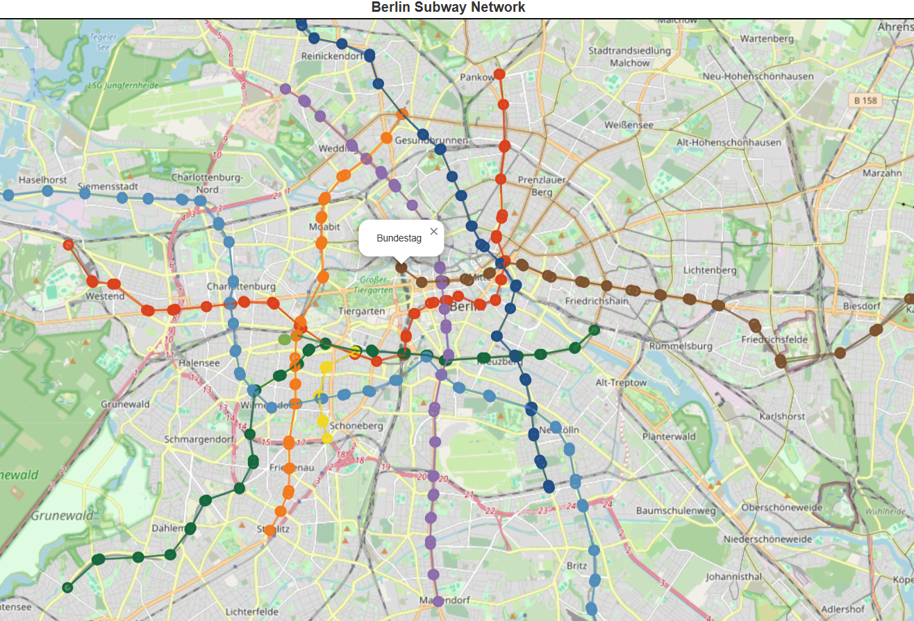

# 🚇Subway Network Visualisation with Overpass API, Networkx and Folium

Explore and visualize subway networks from various European cities using data extracted from OpenStreetMap via the Overpass API. This project provides an interactive way to analyze public transport systems through NetworkX graphs and Folium maps.

Subway networks are critical components of urban transportation systems. This project combines OpenStreetMap data, NetworkX, and Folium to create:

* Graph-based subway networks to analyze routes and connectivity.
* Interactive maps to visualize subway lines and stations with route-specific colors.

Whether you're a data enthusiast or a transport geek, this project will help you explore public transit systems dynamically.

## Contents

- [Maps for Subway Networks](#maps-for-subway-networks)
- [What You'll Learn](#what-youll-learn)
- [Getting Started](#getting-started)

## 🌍 Maps for Subway Networks
**Interactive Maps**
### 📍London
[]()

### 📍Berlin
[]()

### 📍Paris
[]()

### 📍Madrid
[]()


## What You'll Learn

**By working through this project, you'll gain:**

1. Data Extraction: Learn how to query OpenStreetMap using the Overpass API.
2. Graph Construction: Build and analyze route graphs with NetworkX.
3. Interactive Mapping: Create interactive maps with Folium, including customized node and edge colors.
4. Data Visualization: Use geographic data to visually explore subway systems.

## Getting Started

**Prerequisites**
Ensure you have the following installed:
* Python 3.7+
* Required Python libraries: requests, networkx, folium, matplotlib

**Installation**

1. Clone the repository:
```bash
git clone https://github.com/daameya/Subway-Network-Visualisation-with-Overpass-API.git
cd Subway-Network-Visualisation-with-Overpass-API
```

2. Install dependencies:
```bash
pip install -r requirements.txt
```

3. Run the Jupyter notebooks

4. Use the (city)_subway_network.html to view interactive maps

## [Back Up](#🚇Subway-Network-Visualisation-with-Overpass-API,-Networkx-and-Folium)